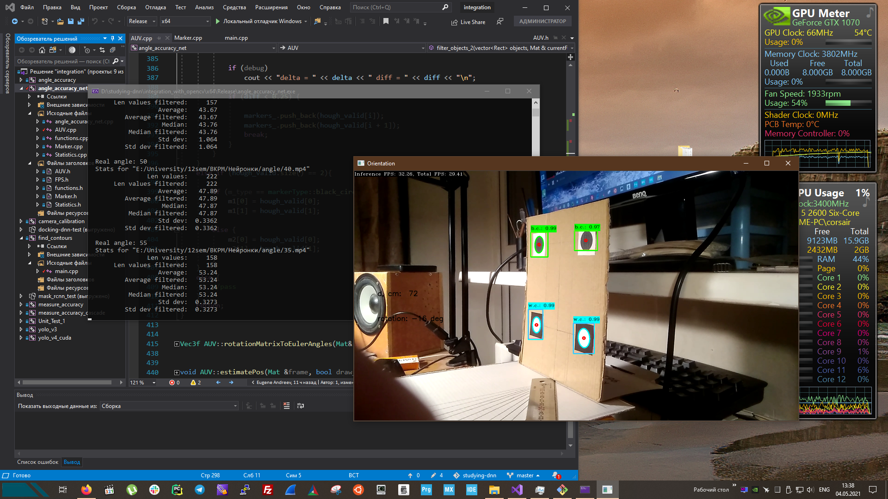

### Измеряем точность определения угла с помощью нейросети



```
Текущая кодовая страница: 1251

  Real angle: 0
  Stats for "E:/University/12sem/ВКРМ/Нейронки/angle/90.mp4"
                Len values:     157
       Len values filtered:       0
                   Average:  -8.223
          Average filtered:       0
                    Median:  -7.677
           Median filtered:       0
                   Std dev:   6.514
          Std dev filtered:       0

  Real angle: 5
  Stats for "E:/University/12sem/ВКРМ/Нейронки/angle/85.mp4"
                Len values:     155
       Len values filtered:     155
                   Average:   8.352
          Average filtered:   8.352
                    Median:   8.411
           Median filtered:   8.411
                   Std dev:  0.4605
          Std dev filtered:  0.4605

  Real angle: 10
  Stats for "E:/University/12sem/ВКРМ/Нейронки/angle/80.mp4"
                Len values:     172
       Len values filtered:     172
                   Average:   10.78
          Average filtered:   10.78
                    Median:   10.76
           Median filtered:   10.76
                   Std dev:  0.2623
          Std dev filtered:  0.2623

  Real angle: 15
  Stats for "E:/University/12sem/ВКРМ/Нейронки/angle/75.mp4"
                Len values:     157
       Len values filtered:     157
                   Average:   14.07
          Average filtered:   14.07
                    Median:   14.11
           Median filtered:   14.11
                   Std dev:  0.1678
          Std dev filtered:  0.1678

  Real angle: 20
  Stats for "E:/University/12sem/ВКРМ/Нейронки/angle/70.mp4"
                Len values:     164
       Len values filtered:     164
                   Average:   17.31
          Average filtered:   17.31
                    Median:   17.31
           Median filtered:   17.31
                   Std dev:    0.11
          Std dev filtered:    0.11

  Real angle: 25
  Stats for "E:/University/12sem/ВКРМ/Нейронки/angle/65.mp4"
                Len values:     178
       Len values filtered:     178
                   Average:   22.34
          Average filtered:   22.34
                    Median:    22.4
           Median filtered:    22.4
                   Std dev:   1.203
          Std dev filtered:   1.203

  Real angle: 30
  Stats for "E:/University/12sem/ВКРМ/Нейронки/angle/60.mp4"
                Len values:     162
       Len values filtered:     162
                   Average:   27.91
          Average filtered:   27.91
                    Median:   27.91
           Median filtered:   27.91
                   Std dev:  0.3898
          Std dev filtered:  0.3898

  Real angle: 35
  Stats for "E:/University/12sem/ВКРМ/Нейронки/angle/55.mp4"
                Len values:     165
       Len values filtered:     165
                   Average:   33.22
          Average filtered:   33.22
                    Median:   33.25
           Median filtered:   33.25
                   Std dev:  0.9054
          Std dev filtered:  0.9054

  Real angle: 40
  Stats for "E:/University/12sem/ВКРМ/Нейронки/angle/50.mp4"
                Len values:     155
       Len values filtered:     155
                   Average:   37.48
          Average filtered:   37.48
                    Median:   37.46
           Median filtered:   37.46
                   Std dev:   0.103
          Std dev filtered:   0.103

  Real angle: 45
  Stats for "E:/University/12sem/ВКРМ/Нейронки/angle/45.mp4"
                Len values:     157
       Len values filtered:     157
                   Average:   43.67
          Average filtered:   43.67
                    Median:   43.76
           Median filtered:   43.76
                   Std dev:   1.064
          Std dev filtered:   1.064

  Real angle: 50
  Stats for "E:/University/12sem/ВКРМ/Нейронки/angle/40.mp4"
                Len values:     222
       Len values filtered:     222
                   Average:   47.89
          Average filtered:   47.89
                    Median:   47.87
           Median filtered:   47.87
                   Std dev:  0.3362
          Std dev filtered:  0.3362

  Real angle: 55
  Stats for "E:/University/12sem/ВКРМ/Нейронки/angle/35.mp4"
                Len values:     158
       Len values filtered:     158
                   Average:   53.24
          Average filtered:   53.24
                    Median:   53.24
           Median filtered:   53.24
                   Std dev:  0.3273
          Std dev filtered:  0.3273

  Real angle: 60
  Stats for "E:/University/12sem/ВКРМ/Нейронки/angle/30.mp4"
                Len values:     183
       Len values filtered:     183
                   Average:   57.79
          Average filtered:   57.79
                    Median:   57.81
           Median filtered:   57.81
                   Std dev:  0.2269
          Std dev filtered:  0.2269
Total time in seconds: 134
```