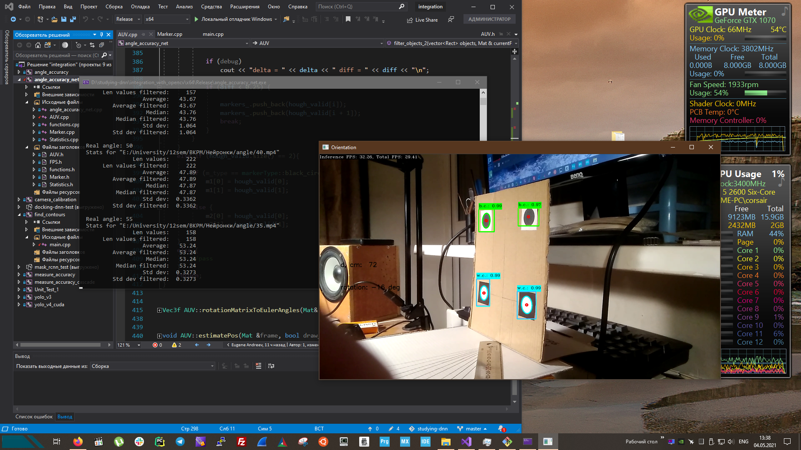

### Примеры обучения, интеграции и применения нейронной сети

- Об обучении `YOLO v4`: [ссылка](./neural-nets/yolo_v4/readme.md)

- Измерение точности детектирования объектов с помощью нейросети:  [ссылка](./integration_with_opencv/measure_accuracy/readme.md)
- Измерение точности детектирования объектов с помощью каскада Хаара:  [ссылка](./integration_with_opencv/measure_accuracy_cascade/readme.md)

- Измерения точности определения углового положения с помощью нейросети:  [ссылка](./integration_with_opencv/angle_accuracy_net/readme.md)
- Измерения точности определения углового положения с помощью каскада Хаара: [ссылка](./integration_with_opencv/angle_accuracy/readme.md)
